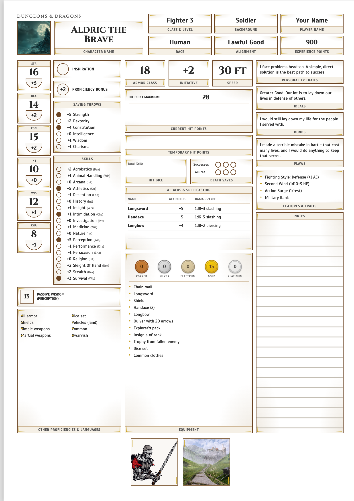

# D&D 5e Sheet Generator

Generate printable HTML character sheets and magic item cards from JSON data files.



**[View Example PDF](output/example/Aldric_the_Brave.pdf)**

## Quick Start

```bash
# Generate HTML only
python3 generate.py example.json

# Generate HTML + PDF
python3 generate.py example.json --pdf

# Full pipeline: HTML + PDF + compressed print version, then open
python3 generate.py example.json --compress --open

# Generate a magic item
python3 generate.py characters/thorek/items/ring_of_wild_hunt.json --compress --open
```

## Command Line Options

```
python3 generate.py <input.json> [options]

Options:
  --pdf           Generate PDF via Chrome headless
  --compress      Compress PDF for printing (implies --pdf)
  --dpi <value>   DPI for compression (default: 150)
  --open          Open output files when done
  --output <dir>  Custom output directory
  -h, --help      Show help message
```

## How It Works

```
┌─────────────────────────────────────────────────────────────────┐
│                      generate.py                                │
│                                                                 │
│  Input: characters/example.json                                 │
│         characters/<name>/items/<item>.json                     │
└─────────────────────────────────────────────────────────────────┘
                              │
        ┌─────────────────────┼─────────────────────┐
        ▼                     ▼                     ▼
┌───────────────┐   ┌─────────────────┐   ┌─────────────────┐
│  HTML Output  │   │   PDF Output    │   │  Print Output   │
│               │   │  (--pdf flag)   │   │ (--compress)    │
│  *.html       │   │  *.pdf (vector) │   │  *_print.pdf    │
│               │   │  Chrome headless│   │  (rasterized)   │
└───────────────┘   └─────────────────┘   └─────────────────┘
```

## Project Structure

```
d_and_d/
├── characters/
│   ├── example.json              # Character data
│   └── <name>/
│       └── items/
│           └── <item>.json       # Magic item data
├── images/
│   ├── example/*.jpg             # Character images
│   └── <name>/*.jpg              # Character-specific images
├── styles/
│   ├── sheet.css                 # Base stylesheet
│   └── item.css                  # Item-specific styles
├── tools/
│   └── package.sh                # Create distribution zip
├── output/                       # Generated files (gitignored)
│   ├── <CharacterName>/
│   │   ├── *.html
│   │   ├── *.pdf
│   │   └── *_print.pdf
│   └── items/
│       ├── *.html
│       ├── *.pdf
│       └── *_print.pdf
└── generate.py                   # Main generator script
```

## Requirements

- **Python 3** - Core generator
- **Google Chrome** - PDF generation (headless mode)
- **poppler** - PDF compression (`brew install poppler`)
- **img2pdf** - PDF compression (`brew install img2pdf`)

Note: poppler and img2pdf are only required for `--compress` option.

## Documentation

| Guide | Description |
|-------|-------------|
| [CREATE_CHARACTER.md](CREATE_CHARACTER.md) | Character sheet creation guide with examples |
| [CREATE_ITEM.md](CREATE_ITEM.md) | Magic item card creation guide with content types |
| [SCHEMA.md](SCHEMA.md) | Complete JSON schema reference for all document types |

## Document Types

### Character Sheets
4-page character sheets with:
- Page 1: Stats, skills, combat, equipment
- Page 2: Background, appearance, backstory
- Page 3: Spellcasting
- Page 4: Quick reference, companion stats

### Magic Items
Single-page item cards with:
- Header with image, name, rarity, attunement
- Two-column layout with customizable sections
- Support for tables, properties, quotes, and more

## Print Settings

When printing manually from browser:
1. File → Print (Cmd + P)
2. Enable **Background graphics**
3. Set margins to **Minimum**
4. Print all pages

## Customizing Styles

Edit `styles/sheet.css` for characters or `styles/item.css` for items.

Key CSS variables:
```css
:root {
    --bg-page: #ffffff;
    --border-dark: #6b4423;
    --accent-primary: #8b4513;
    --accent-secondary: #c9a227;
    --font-display: 'Cinzel', serif;
    --font-body: 'Scada', sans-serif;
}
```

## Distribution

Create a zip package for sharing:

```bash
./tools/package.sh
# Creates output/packages/dnd-character-sheet.zip
```
